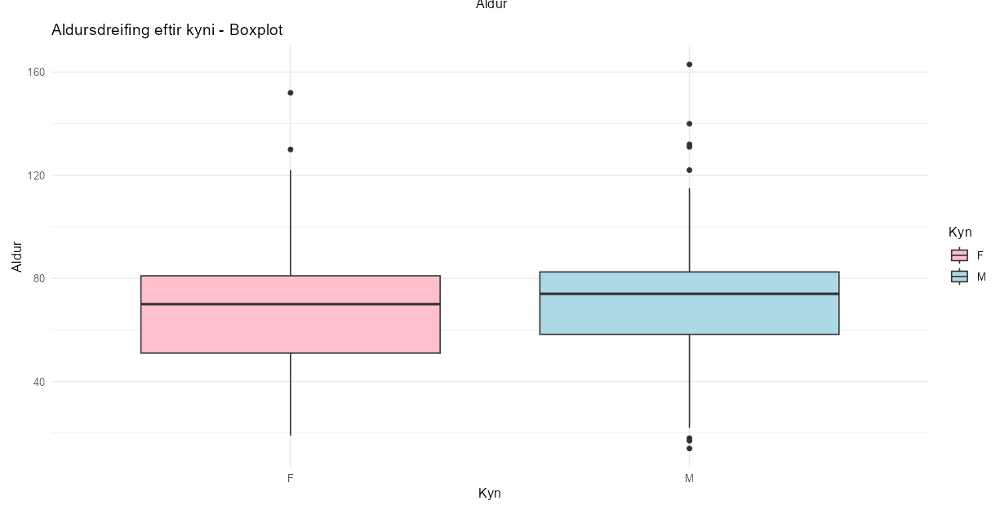
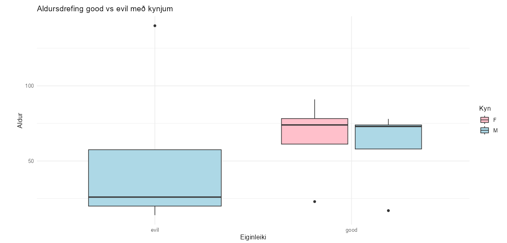
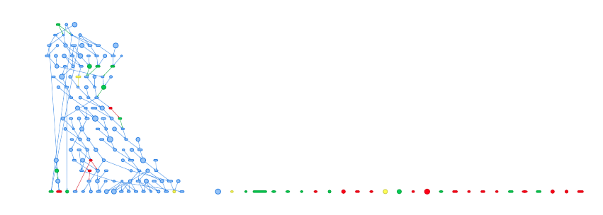
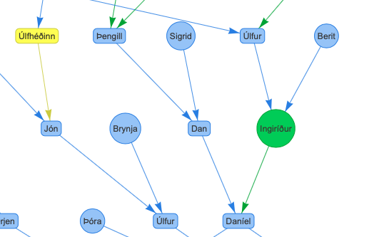
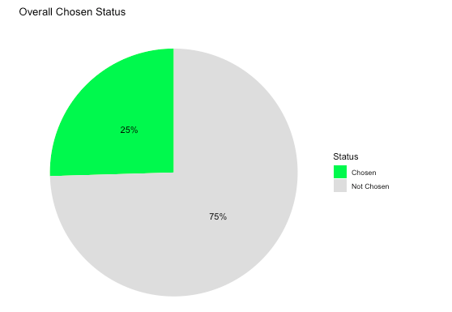

# Ísfólkið

## Lýsing á gagnaöflun
Við gerð þessa mælaborðs voru sótt gögn úr gagnagrunningu isfolkid.db. Hann samanstendur af töflunum alvarpid, children, marriage, storytel_isfolkid, books, family, special_events og storytel_iskisur sem innihalda allar ýmiss gögn um bókaseríuna Sagan um ísfólkið.  upplýsingum tengdum ísfólkinu. Töflurnar í gagnagrunninum eru `alvarpid` og `storytel_iskisur`, sem geyma gögn um hvaðvarpsþætti um ísfólkið,`books` og `storytel_isfolkid`, geyma gögn um bækurnar og hljóðbækurnar, `family`, `children` og `marriage` sem geyma gögn um fjölskyldutengsl, börn og hjónabönd ísfólksins og `special_events` sem geymir upplýsingar um stór atvik sem gerast í bókunum.
Þessar töflur voru skoðaðar og séð hvernig hvaða upllýsingar og állyktanir var hægt að draga úr þeim, til að mynda hvernig ýmsir hlutir þróuðust og breyttust tíma og fleira til þess að reyna að sýna einhverja sögu sem að myndi fanga athygli markhópsins. 

Í greiningu á gögnum er mikilvægt að átta sig á hver sé markhópurinn. Því mismunandi gögn
eru áhugaverð fyrir ólíka hópa. Markhópurinn fyrir þetta verkefni er  flest fólk sem er rétt
skriðið yfir tvítugt. Bókaflokkurnn sem gögnin byggjast á kom fyrst út á níuanda áratug 20. aldarinnar.
Urðu þær í kjölfarið mjög vinsælar en komu alls út 47 bækur. Eftir óformlega könnun innan
markhópsins komst í ljós að flestir hefðu aldrei heyrt um bækurnar, nokkrir höfðu heyrt talað
um bækurnar en vissu ekki mikið um þær og aðeins ein manneskja hafði lesið þær. Aðgangur var að
nokkrum tödlum í gagnagrunninum. Bæði almennar upplýsingar um bækurnar og hlaðvörp er fjalla um
bækurnar. En einnig gögn sem byggjast á söguþráðinum og persónunum sjálfum. Var því tekin sú ákvörðun
miðað við þann markhóp sem efnið yrði kynnt fyrir að velja gögn tengd sjálfum persónunum. Þá væri
verið að kynna þeim fyrir persónunum en einnig vekja áhuga þeirra á bókunum. Meðan að gagnagrunnar
tengdir bókunum og hlaðvörpunum væri líklegara áhugaverðari fyrir fólk sem hefur nú þegar lesið
bækurnar. Viljum að markhópurinn átti sig á hvað Ísfólkið bíður upp á margþættan söguþráð með að
sýna þeim gögn um persónurnar. Frásögnin mun vonandi hvetja einhverja nemendur til þess að kynna sér
bækurnar frekar eða jafnvel hefja lestur á þeim.

Tengjast gagngagrunni.

  con <- dbConnect(RSQLite::SQLite(), "slóð að gagnagrunni") Til að tengjast gagnagrunninum og geta unnið með
  hann var hann sóttur með þessu móti. Þar sem hann ar sóttur með slóð á staðinn þar sem hann var vistaður í
  heimasvæði notenda. Nokkuð einfalt var því að hlaða niður gagnagrunninum í sína eigin tölvu og fá hann svona
  inn í R umhverfið þar sem var síðan hægt að vinna með hann.

## Gagnavinnsla
Til að skoða Börn ísfólksins langaði okkur að sjá

**Hversu mörg börn fæddust á hverju ári**
Til að finna hversu mörg börn fæddust á hverju ári var SQL fyrirspurnin `dbGetQuery()` til að sækja fjölda barna sem fæddust á hverju ári úr family- og children-töflunum. Hún skoðar dálkinn `child_birth_year` og telur hversu mörg börn eru fædd hvert ár og vistar það í dálkinn `num_children_born`
Til þess að skoða niðurstöðurnar var `geom_line()` notað til að teikna línu sem tengir saman fjölda barna á hverju ári og `geom_point()` notað til að setja punkta á línuna fyrir hvert ár

Á grafnu má sjá að flest árin voru tvö börn fædd en flöktir þó mikið upp og niður. Minnst var 1 barn fætt og mest 6 á einu ári.

**Meðalaldur foreldra við fæðingu**
Til þess að kanna meðalaldur foreldra þegar að þau eignuðumst börn var SQL fyrirspurnin `(dbGetQuery())` notuð til að sækja gögn úr gagnagrunninum family. Hún finnur fæðingarár barna (`child_birth_year`) og reiknar út meðalaldur móður og föður þegar barnið fæddist með `AVG()`. Gögnin eru svo hópuð eftir fæðingarári barnsins og röðuð í tímaröð með `GROUP BY` og `ORDER BY`.
Til að skoða niðurstöðurnar var búið til punktarit með `geom_point()` sem aðm sýnir punkta fyrir meðalaldur mæðra og feðra á hverju ári og svo `geom_smooth()` sem setur inn línur sem sýnir þróun aldurs mæðra og feðra yfir tíma.

Það sést vel á grafinu að meðalaldur feðra er nánast alltaf meiri en mæðra. Bilið milli þeirra minnkar þó örlítið þegar að fer að líða á en feðurnir eru alltaf eldri.

**Fjöldi barna á hjónaband**
TIl þess að kanna fjölda barna í hverju hjónabandi var SQL fyrirspurnin `(dbGetQuery())` notuð til að tengja töflurnar marriage og children og telja hversu mörg börn eru í hverju hjónabandi. Úr þvi var búin til tafla með dálkunum `children_count` og `number_of_marriages`. Til þess að skoða niðurstöðurnar var búið til súlurit með ´geom_bar()´ sem sýnir hversu mörg hjónabönd eiga hvern fjölda af börnum.

Ættartengslar-net

Það er áhugavert við þessar bækur hversu margar persónur koma við sögu. Margar af þeim eru skyldar
og er stór þáttur í bókunum bölvun sem leggst á ættinni og erfist á milli kynslóða. Þar sem hópurinn
hefur aðgang að gagnagrunni um fjölskyldutengsl, er áhugavert að setja upp net þar sem hægt er að sjá
hverjir tengast hverjum. Og hvernig bölvunin erfist svo á milli kynnslóða.

Ýmsum pökkum er installað og síðan settir inn sem library til að geta unnið gröfin.
Shiny = Notað til að byggja gagnvirk vefforrit beint frá R.
RSQLite: Leyfir R að tengjast SQL fyrirspurnin þannig við getum notað þær í kóðanum, Erum að vinna með
gögn.
ggplot2: Pakki til að búa til ýmiss gröf úr gögnum.
visNetwork: Mikilvægt við að sýna sjónrænt netakerfi eins og hér við að sýna ættartengsla-net. Vinnur
með hnúta og tengingar.

Til að vinna með gögnin eru þau sótt með SQL skipuninni:
 family_data <- dbGetQuery(con, "SELECT id, mom, dad, name, gender, chosen_one FROM family")
  dbDisconnect(con)

  En með henni er sótt þau gögn sem þarf til þess að geta unnið með þau fyrir myndrænu framsetnignuna.

  Þegar tengslanetið var sett upp var notast við skipanir eins og
  nodes <- data.frame(
  id = family_data$id,
  label = sapply(strsplit(family_data$name, " "), `[`, 1),

Þetta tengir og skipuleggur hnútana í tengslanetinu upp. Fyrir skýrleika í netinu kemur eingöngu fyrsta nafnið
fram. Sum nöfnin voru býsna löng og gat því verið erfitt að koma öllu fyrir þar sem mörg nöfn tilheyra gagnagrunninum.
Til að hafa grafið sem auðskiljanlegast var notað gögnin um kyn, og sýnt konur með hring í netinu og karla með kassa.
Einnig var litað þá sem höfðu fengið bölvunina. Hægt er að skipta bölvuninni í þrjá flokka og voru þeir litaðir eftir
því. Grænn fyrir þá sem eru með álögin en góðir, rauðir þeir sem hafa bölvunina og eru illir en gulir þeir sem hafa
fengu álögin en voru ,,converted". Þá ætti að vera auðvelt að lesa út frá grafinu hver hefur hvaða álög og hvernig það
erfðist.

Tveir gagnarammar eru búnir til og sameinaðir með því að nota rbind. Hver gagnarammi táknar tengsl eða tengingu í
 net-grafinu. from = family_data$mom, to = family_data$id er skipun til að tengja móðir við barn, einnig sama skipun
 framkvæmd nema tenging milli föður og barns.

 Innan VisNetwork setup er ýmsar skipanir keyrðar til að stjórna hvernig gröfin líta út í shiny.

 Því næst var búið til tvö skífurit annað sem sýnir með skýru móti hlutfallslegan mun á milli þeirra sem fengu bölvun og þeirra
 sem sluppu við hana. Hitt sýnir svo gögn yfir það hverjir með bölvun eru illir, góðir eða converted. Þetta ætti því
 að gefa lesanda grafanna góða mynd á hlutfall milli persóna bókaflokksins, sem á hvíla álög.

 Öll gögn fyrir þessi skífurit eru sótt í dálkinum chosen_one með skipuninni status_counts <- table(family_data$chosen_one).

status_data <- as.data.frame(status_counts) breytir töflunni í gagnaramma til notkunar í ggplot2. status_data$Prop
<- status_data$Freq / sum(status_data$Freq), er notað til að reikna fjölda sem tilheyrir hverjum hópi. GGplo2 er nýtt fyrir
til að setja upp gröfin en einnig geom_bar og coord_polar sem eru mikilvæg þegar unnið er með skífurit.

## Marktækar niðurstöður
Helstu niðurstöður sem hægt er að lesa úr gröfunum er meðal annars: hvernig aldursdrefingin er eftir kynjum, hver meðallífstími karlar sé og meðallífstími kvenna sé.
Að meðaltali lifðu karlar aðeins lengur heldur en konurnar og dreifingin var mun meiri hjá körlunum heldur en hjá konum.

Mynd 1: Hér sést hvernig aldursdreifingin á sér stað 

Einnig er hægt að lesa úr gröfunum hvort persónurnar sem voru góðar eða vondar sem lifðu lengur, og að meðaltali voru persónurnar sem voru góðar sem lifðu lengur heldur en þær persónur sem voru vonar. Þær persónur sem voru góðar þá lifðu konur að meðaltali aðeins lengur heldur en karlar, en það voru engar vondar konur til.
Þetta gefur okkur góða yfirsýn yfir það hvað persónurnar lifðu lengi í sögunum, hvort það var munur á líftíma kynja og hvort það hafði áhrif á líftíma persónanna hvort þær voru góðar eða vondar.

Mynd 2: Hérna sést aldursdreifingin með good vs evil

Þegar horft er á fjölskyldu tengingarnar er áhugavert að sjá hversu þétt tréið. Hversu margar persónur eru í raun
tengdar og að það sé jafnvel nokkur skyldleiki á milli sumra maka. Einnig er áhugavert að sjá niðurstöður um álög.
Álögin hvíla á um fjórðungi persóna en einnig sést út frá tengslatrénu að hár hluti persóna sem var skrifaður inn fyrir
utan fjölskyldutréið ber bölvunina. Þannig maður spyr sig hvort að höfundur hafi viljað kryddað upp á söguþráðinn með
því að skrifa inn persónur sem hafa álögin áhvílandi á sér. Niðurstöður sína einnig að ekki er marktækur munur á milli
góðra og illa eða 46,3 % eru góðir með álögin en 43,9 illir. Restin eða 9,8 % eru converted. Áhugavert að sjá þessa
skiptingu og maður getur rétt svo ímyndað sér að það sé nóg um að vera í þessum bókum fyrst að fjórðungur sögupersóna
hafa einhvers konar álög yfir sér. En sérstaklega þar sem svona hátt hlutföll notar það til ills.

Mynd 3: Hér sést tréið úr fjarlægð. Sést vel hversu margar persónur eru notaðar og litirnir eftir álögum.

Mynd 4: Sýnir betur tengingar hér sést t.d. að Ingríður er með álögin og er góð. Foreldrar hennar eru úlfur og Berit.
Á hún barnið Daníel með Dan.

Mynd 5: Hér sést skýrt hversu margir eru með álög.

Mynd 6: Hér sést hlutfallið á milli góðs, ills og converted.

Á niðurstöðunum má sjá að langflestir eiga tvö börn en mesti fjöldi barna frá einu hjónabandi eru 10 börn.

Út frá þessum gröfum og persónum bókanna ætti vonandi markhópurinn að hafa frekari áhuga á bókaflokknum
um Ísfólkið. Gröfin sína fram á hversu fjölbreyttur og flókinn bókaflokkur þetta er. En það er t.d. sýnt
með fjölskydutengsla-neti þar sem sést hversu margar persónur koma við sögu. Einnig er sínt hversu algengir
álög eru innan fólksins í bókunum. Ætti það vonandi að vekja frekari áhuga á bókunum fyrir fólk sem hefur
gaman að ævintýrasögum. Einnig komu gagnlegar upplýsingar fram um aldu

## Mælaborðið
Mælaborðið inniheldur nokkur gröf með þeim helstu upplýsingum um persónurnar sem eru í bókinni. Farið er yfir víðan völl þar með talið, líftími persónanna, fjölskyldur persónann og fjöldi barna og margt fleira. Tilgangurinn er að leyfa þeim sem hafa lesið bækurnar að fá að sjá hvernig persónurnar eru að haga sér tölfræðilega. Hins vegar er þetta líka mjög merkilegt fyrir þá sem hafa aldrei lesið bækurnar, þar sem mælaborðið á að gefa upp góða hugmynd hvernig persónurnar í sögunni eru og við hverju má búast.

